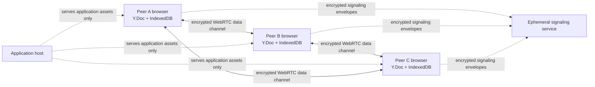

# P2P Encrypted Workspace: Architecture and Security Model

## Product boundary

P2P Encrypted Workspace is a **browser-local, peer-to-peer document editor**. The application server delivers the web interface only; it has no API, database table, or object-storage path for document bodies, editor updates, exports, room secrets, or participant names. Documents and document metadata are retained in the browser's IndexedDB database. The included server-side framework remains unused by the collaboration data path.

## Collaboration topology

Each active workspace uses a Yjs `Y.Doc` as its authoritative local state. Tiptap binds its document model to a Yjs XML fragment, and Yjs merges concurrent operations deterministically through CRDT semantics. The `y-indexeddb` provider persists every local update to the browser database, allowing the editor to reopen and accept changes without a network connection. When peers later become reachable, `y-webrtc` propagates the accumulated CRDT updates and the replicas converge.[1][2]

## Room and invite design

The creator receives an eight-character uppercase room code and a randomly generated 256-bit room secret. The shareable link takes the form `https://app.example/room/ROOMCODE#key=SECRET`. The fragment is deliberately used for the secret because browsers do not send URL fragments in HTTP requests. A derived room identifier, calculated in the browser from the room code and secret, is passed to `y-webrtc`; the raw secret is also supplied as the provider password. The derived room identifier avoids exposing a human-readable room name to the signaling service.

| Item | Location | Sent to application server? | Sent to signaling service? |
| --- | --- | --- | --- |
| Rich-text document, CRDT updates, exports | Browser IndexedDB and peer browsers | No | No |
| Room secret | Browser URL fragment and local IndexedDB | No | Used locally to encrypt signaling envelopes |
| Room code | URL path and browser UI | No document meaning | Only a derived, opaque identifier is used |
| WebRTC offers, answers, and ICE candidates | Ephemeral signaling relay | No | Yes, but protected by the provider password |
| Network metadata such as IP address | Browser, STUN/TURN and network infrastructure | Not intentionally stored | May be observable to WebRTC infrastructure |

## Encryption claim and limits

The app uses WebRTC data channels for peer synchronization. WebRTC uses encrypted transport between the connected peer endpoints. `y-webrtc` additionally accepts a password and documents that it encrypts communication over untrusted signaling services so that WebRTC connection information and shared data are not exposed through those signaling messages.[3] The product can therefore accurately say: **document updates travel directly between peers through encrypted WebRTC channels; the application server never receives document content; and the signaling service is used only to help peers establish connections.**

The product must not overclaim. The signaling and network infrastructure can still observe connection timing and network-level metadata. Browser IndexedDB is local persistence, not an application-managed encrypted vault, so protection of offline content at rest depends on the user's browser profile and device security. A compromised participant endpoint or intentionally shared invite secret also falls outside the end-to-end protection model.

## Capacity and availability model

The intended room size is **up to 10 simultaneous participants**. This is intentionally below y-webrtc's ordinary per-peer connection ceiling and suits its small-room peer mesh model.[3] The interface will warn before the supported limit is exceeded and will configure a maximum of nine remote connections per peer. There is no central authority that can securely enforce membership or recover a lost room secret; this trade-off is intrinsic to the privacy-first, serverless-document design.

Offline edits are first saved locally. Synchronization begins only when the browser has both network connectivity and another reachable participant in the same room. If every other peer has discarded the room or remains offline, local work is preserved but cannot be replicated until a peer returns. The design deliberately prioritizes user ownership and local persistence over centralized backup.

## Academic mapping

| MCA concept | Implementation evidence |
| --- | --- |
| Distributed systems | Independently editable replicas converge after concurrent and offline changes. |
| Conflict-free replicated data types | Yjs represents updates as CRDT operations and merges them without a central ordering service. |
| Peer-to-peer networking | Browsers use WebRTC data channels after signaling-assisted connection establishment. |
| Applied cryptography | Encrypted WebRTC transport and password-protected signaling envelopes protect data in transit. |
| Offline-first architecture | IndexedDB persists the Yjs state locally before any peer is reachable. |
| Privacy engineering | The system keeps document content out of the application and signaling-server storage paths. |

## References

[1]: https://docs.yjs.dev/getting-started/allowing-offline-editing "Yjs: Offline Support"
[2]: https://github.com/yjs/y-indexeddb "y-indexeddb: IndexedDB database provider for Yjs"
[3]: https://github.com/yjs/y-webrtc "y-webrtc: WebRTC Connector for Yjs"
