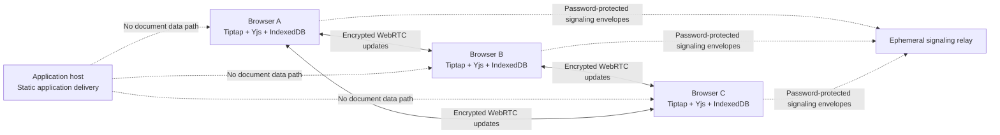

# Peer-to-Peer Encrypted Workspace

## A Local-First Collaborative Document Editing System Using Yjs, WebRTC, and IndexedDB

**Programme:** Master of Computer Applications (MCA)  
**Project type:** Distributed Systems and Privacy Engineering  
**Prepared by:** Yogeshwari  
**Prepared with:** Manus AI

## Abstract

Peer-to-Peer Encrypted Workspace is a local-first collaborative document editor designed for small groups of up to ten participants. The project addresses a practical privacy concern in conventional cloud editors: document operations commonly pass through and are retained by a central service. In this design, each participant browser maintains an independent Yjs document replica, stores it locally through IndexedDB, and exchanges mergeable document updates directly with peers using WebRTC data channels. A signaling relay assists the initial discovery and connection process but is not a document store, a document-processing API, or an editing authority.

The system uses conflict-free replicated data types (CRDTs) to make concurrent and offline editing safe. Users can create browser-local documents, share a private room invite, edit concurrently, observe cursor presence, recover local work after a refresh or disconnection, and export the current document as plain text or Markdown. The implementation demonstrates eventual consistency, peer-to-peer networking, browser persistence, practical cryptographic boundaries, and transparent disclosure of the privacy model.

## 1. Introduction

Real-time editors are often implemented as centralized applications. A client sends an operation to a server; the server orders, stores, and distributes it to other users. This approach is convenient for backup and access control, but it expands the trust placed in the application provider. A privacy-first alternative is to keep document replicas at the edge: in the participants’ browsers.

Peer-to-Peer Encrypted Workspace investigates that alternative for a bounded small-group use case. Rather than claiming that all infrastructure disappears, the project narrows infrastructure’s role. Signaling is still required to help browsers locate one another, and network services may observe connection-level metadata. The application server, however, has no route or storage model for document content. The core text, Yjs update stream, private invite key, and browser export remain outside the application-server data path.

## 2. Problem Statement

The principal problem is to provide collaborative rich-text editing without relying on a central document database or a server-side conflict-resolution service. The system must remain useful when a participant is temporarily offline, preserve concurrent edits, identify active participants, and clearly communicate the precise privacy guarantees and limitations to the user.

## 3. Objectives

| Objective | Implementation evidence |
| --- | --- |
| Enable collaborative rich-text editing | Tiptap is bound to a shared Yjs document. |
| Resolve concurrent edits without central ordering | Yjs CRDT updates merge deterministically between replicas. |
| Support browser-local persistence | `y-indexeddb` persists Yjs state in IndexedDB. |
| Keep document content out of the application server | The collaboration path has no document API or database table. |
| Support private peer rooms | Room codes and a random 256-bit secret create shareable invites. |
| Make presence visible | Awareness metadata drives name badges, cursor colors, and the peer panel. |
| Support academic demonstration | The app includes a report, architecture visual, slide narrative, and viva questions. |

## 4. Scope and Constraints

The intended capacity is **up to ten participants** in a room. This is a deliberate design decision: a browser peer mesh creates a connection and bandwidth responsibility for every participant. The scope prioritizes a reliable college demonstration and understandable distributed-systems architecture over unbounded scale. The project does not claim serverless backup, central account recovery, access revocation after an invite key is shared, or endpoint protection against a compromised device.

## 5. System Architecture

The frontend is implemented with React and TypeScript. Tiptap provides the rich-text interface, while a Yjs `Y.Doc` acts as the shared document model. Tiptap’s collaboration extension binds editor content to a Yjs field. The `y-indexeddb` provider persists the document locally, and the `y-webrtc` provider distributes Yjs updates directly between browsers. The provider also supports a password for protecting sensitive signaling communication through untrusted signaling infrastructure.[1] [2] [3]

| Layer | Technology | Responsibility | Document-content role |
| --- | --- | --- | --- |
| Presentation | React, Tiptap, Tailwind CSS | Editing interface, workspace dashboard, academic pages | Reads and writes browser-local document state |
| Replication | Yjs | CRDT document updates and deterministic merging | Stores operations in every participant replica |
| Persistence | `y-indexeddb` | Durable browser-local replica storage | Persists updates in IndexedDB |
| Peer transport | WebRTC through `y-webrtc` | Direct participant synchronization | Carries encrypted document updates between peers |
| Discovery | Signaling relay | Exchanges temporary connection-establishment information | Does not intentionally store document bodies |
| Application host | Static full-stack scaffold | Delivers the user interface | Has no document-content endpoint |

## 6. CRDT-Based Synchronization

A CRDT is a data structure designed so independently modified replicas can merge without a central conflict resolver. In this project, each browser may continue editing while disconnected. The browser records local Yjs changes and stores them in IndexedDB. Once compatible peers reconnect, missing CRDT updates are exchanged and merged. This behavior avoids the simplistic “last writer wins” approach that can destroy a concurrent edit.

Yjs documents are useful for this architecture because network providers can propagate the same Yjs update format through different transport mechanisms. The offline persistence provider stores the local document state and fires a synchronization event after available local content has been restored.[1] [2]

## 7. WebRTC Signaling and Peer Synchronization

WebRTC peers cannot generally contact one another without exchanging connection information first. The signaling relay performs that narrow initial function. It helps peers exchange offers, answers, and network-candidate information. After a data channel opens, the application synchronizes document updates through the WebRTC peer relationship rather than by sending document operations through the application server.

The implementation derives an opaque room name from the room code and private secret. The application does not send the raw secret as an HTTP request field: the invite uses a URL fragment, which browsers do not include in the request sent to the application host. The secret is passed to `y-webrtc` as a password so sensitive communication over signaling infrastructure is encrypted according to the provider’s documented model.[3]

## 8. Offline-First Persistence

Offline behavior is a normal state rather than a separate export/import process. The local Yjs document is restored from IndexedDB first. A user can type, refresh the page, close the tab, or lose connectivity while edits remain in the local browser store. When the network and at least one valid room peer become available again, the provider synchronizes the missing updates. The Yjs documentation identifies `y-indexeddb` as the browser database adapter used for this offline editing approach.[1] [2]

## 9. Security and Privacy Model

The central privacy guarantee is deliberately narrow and testable:

> **Document text, document updates, browser exports, and private room secrets are not transmitted to or stored by the application server.**

Document synchronization occurs over WebRTC data channels. The y-webrtc provider documents encryption and authorization support over untrusted signaling servers; when supplied, a password protects sensitive communication through the signaling service.[3] The system also makes the local browser persistence model visible in the interface instead of implying cloud backup.

| Asset or event | Expected location | Application server receives it? | Important limitation |
| --- | --- | --- | --- |
| Document content and Yjs updates | Browser memory, IndexedDB, connected peer browsers | No | A compromised participant endpoint can access its local content. |
| Private room secret | Browser URL fragment and local document registry | No | Anyone given the complete secret can join that room. |
| Signaling messages | Ephemeral signaling relay | No document body | Connection-establishment data is necessary for WebRTC. |
| Network-level metadata | Peers and network infrastructure | Not intentionally stored by the app | IP addresses, timing, and connectivity metadata are outside the content guarantee. |
| Awareness data | Connected peer browsers | No application-server persistence | Names and cursor details are ephemeral but visible to room participants. |

The privacy claim must not be exaggerated. A peer-to-peer application is not anonymous by default. Participants may learn network information through WebRTC, and an unlocked browser profile or compromised device can expose browser-local data. These limitations are stated in the application’s privacy panel and are appropriate points for viva discussion.

## 10. Key Functional Features

| Feature | User outcome |
| --- | --- |
| Local document dashboard | Users can create, rename, list, and delete documents in IndexedDB. |
| Concise secure room invite | Users host or join through a compact `/r/CODE#SECRET` invite; the secret remains in the URL fragment. |
| Technical rich-text editor | Users format text, use Markdown-style shortcuts, and write syntax-highlighted fenced code blocks through Tiptap and Yjs.[5] [6] |
| Presence and cursors | Users see ephemeral names, distinct colors, carets, and selections. |
| Required local profile | First-use onboarding requires a local display name and cursor color before editing begins. |
| Peer-synchronized room chat | Chat messages are a second Yjs shared type, retained locally and replicated through the same peer room rather than a server chat API. |
| Connection graph | Users see direct peer channels, offline/reconnecting states, and the ten-peer scope. |
| Local appearance settings | Light mode is the default; a user can persist a dark-mode preference in the same browser. |
| Browser-only export | Users download `.txt` or `.md` locally without an upload step. |
| Academic materials | Report, presentation guidance, diagram, and viva preparation are available in-app. |

## 11. Validation Strategy

The project validates source-level correctness with TypeScript checks and Vitest tests. The expanded suite covers room-code generation and concise invites, 256-bit secret shape, Markdown/plain-text export conversion, automatic technical formatting, Yjs chat message models, profile-completion logic, stable participant-color assignment, the ten-person collaboration configuration, room-capacity states, and privacy copy. Visual verification covers the desktop and mobile first-use onboarding as well as the product’s major application views.

For a live demonstration, the recommended experiment is to open the same full invite link in two browser profiles or two devices. The presenter should show the initial local workspace, share the invite, type concurrently, observe cursors and the mesh view, temporarily disconnect one peer, create an offline edit, reconnect, and confirm that the document converges. This is a reproducible functional demonstration, not a fabricated performance benchmark.

## 12. Limitations and Future Scope

The peer mesh is appropriate for small rooms but does not replace a globally scalable collaborative service. A fully decentralized model cannot authoritatively reject every extra participant without adding a trusted membership service. The present limit is therefore displayed as a supported scope and a warning path rather than an impossible central enforcement guarantee.

Future enhancements include a self-hosted signaling relay, user-chosen encrypted backup, key rotation, room membership revocation, attachments, document search, peer-network telemetry that remains local, and controlled experiments for latency and merge behavior under peer churn. These extensions should retain the existing principle that document content does not enter the application-host data path.

## 13. Conclusion

Peer-to-Peer Encrypted Workspace demonstrates that a browser can act as both a durable local editor and a collaborative distributed-system replica. The combination of Yjs CRDTs, WebRTC peer transport, and IndexedDB persistence makes concurrent, offline-first editing feasible without a central document database. Its main contribution is a carefully bounded trust model: infrastructure may assist connection establishment, but document content remains in participant browsers and direct encrypted peer channels. The project therefore provides a strong MCA demonstration of distributed systems, cryptography-aware design, and privacy-first web engineering.

## References

[1]: [Yjs Documentation — Offline Support](https://docs.yjs.dev/getting-started/allowing-offline-editing)

[2]: [y-indexeddb — IndexedDB Database Provider for Yjs](https://github.com/yjs/y-indexeddb)

[3]: [y-webrtc — WebRTC Connector for Yjs](https://github.com/yjs/y-webrtc)

[4]: [Tiptap Documentation — Awareness in Collaboration](https://tiptap.dev/docs/collaboration/core-concepts/awareness)

[5]: [Tiptap CodeBlockLowlight Extension](https://tiptap.dev/docs/editor/extensions/nodes/code-block-lowlight)

[6]: [Tiptap Input Rules](https://tiptap.dev/docs/editor/api/input-rules)
