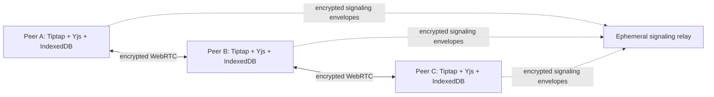

# Peer-to-Peer Encrypted Workspace — Presentation Outline

## Slide 1 — Title and Purpose

**Peer-to-Peer Encrypted Workspace**  
*A local-first collaborative editor using CRDTs, WebRTC, and IndexedDB*

**Speaker notes:** Introduce the project as a Google Docs-like editor designed for small groups, except document content does not pass through the application server. State the main academic themes: distributed systems, conflict-free synchronization, offline-first design, and privacy engineering.

## Slide 2 — Problem Statement

Centralized editors offer convenience but create a central document-processing and storage point. The project asks whether a small group can edit the same document concurrently while keeping the document state in their browsers.

**Speaker notes:** Clearly distinguish “no application-server document storage” from “no infrastructure at all.” Explain that signaling can be needed for WebRTC connection establishment.

## Slide 3 — Architecture and Trust Boundary

**Speaker notes:** Point first to the browser replicas and then to the direct encrypted channels. State that the signaling relay assists discovery but has no document body, editor history, or document storage API.

## Slide 4 — CRDT Theory: Why Concurrent Editing Works

Yjs uses CRDT updates so multiple replicas can make valid edits independently and later merge them deterministically. A central “last writer wins” operation is not required for ordinary text collaboration.

**Speaker notes:** Give a simple example: two users edit different words while one is offline. Both updates are stored locally and later merge after reconnection instead of one user’s work replacing the other’s.

## Slide 5 — Offline-First Workflow

| Stage | Browser behavior |
| --- | --- |
| Open document | Restore Yjs state from IndexedDB. |
| Lose network | Continue editing locally; updates remain persisted. |
| Reconnect | Discover peers and exchange missing Yjs updates. |
| Converge | All reachable valid room replicas reach the same state. |

**Speaker notes:** Emphasize that offline editing is normal. The browser first owns its local state; the network is used to replicate it rather than to make typing possible.

## Slide 6 — Privacy and Security Model

| Guarantee | Limitation |
| --- | --- |
| The application server does not receive document content. | WebRTC and network infrastructure can expose connection metadata. |
| WebRTC peer transport is encrypted. | A compromised participant device can expose its local document. |
| The invite key is stored in the URL fragment, not sent in the page request. | Anyone with the complete invite secret can enter the room. |

**Speaker notes:** This slide is important for credibility. Do not call the project anonymous or unbreakable. Explain the exact boundary that the system achieves.

## Slide 7 — Implemented Features

The working application includes local document management, a rich-text Tiptap editor, Yjs collaboration, IndexedDB persistence, encrypted-room invite links, distinct user cursors, a live peer graph, local exports, an in-app report, and viva preparation.

**Speaker notes:** Show the dashboard and create a document. Then host a private room, copy the invite, and join it from another browser profile or device.

## Slide 8 — Live Demonstration Plan

1. Create a local document and explain that it is in IndexedDB.
2. Convert it into a private room and copy the invite.
3. Open the invite in a second browser profile.
4. Type concurrently and show cursor presence and the peer graph.
5. Disconnect one participant, type offline, reconnect, and observe convergence.
6. Export as Markdown.

**Speaker notes:** A concise two-browser demonstration is more persuasive than showing source files. Show the privacy panel when explaining the displayed connection state.

## Slide 9 — Evaluation, Constraints, and Future Work

The supported scope is up to ten participants because a peer mesh distributes connection work across every browser. Future work includes self-hosted signaling, encrypted user-chosen backup, key rotation, access revocation, and systematic latency experiments.

**Speaker notes:** Explain that the room-size decision is an engineering trade-off. The project deliberately prioritizes a credible local-first small-group model over unlimited centralized scale.

## Slide 10 — Conclusion

The project shows that collaborative editing can be built as a distributed browser application. Yjs solves replica convergence, WebRTC provides direct encrypted transport, and IndexedDB preserves local work. The result is a practical, privacy-first MCA capstone with a transparent trust model.

**Speaker notes:** Finish with the one-sentence takeaway: “The server helps browsers meet; it does not own the document.”

## References

[1] Yjs Documentation — Offline Support: https://docs.yjs.dev/getting-started/allowing-offline-editing  
[2] y-indexeddb: https://github.com/yjs/y-indexeddb  
[3] y-webrtc: https://github.com/yjs/y-webrtc  
[4] Tiptap Awareness: https://tiptap.dev/docs/collaboration/core-concepts/awareness
